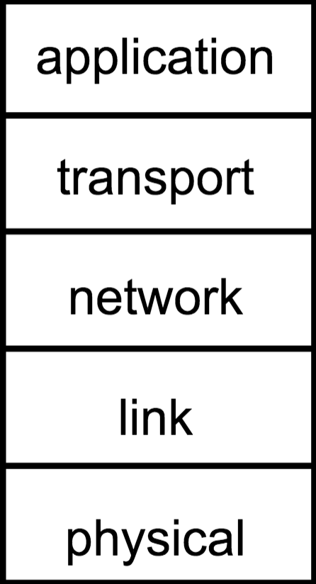
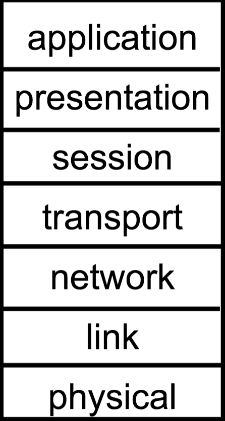

# The Internet

End systems are connected to each other by a network of communication links and packet switches.

**Packet Switch:** Takes a packet from one of its incoming communication links to one of its outgoing communication links. Examples are routers and link-layer switches.

**TCP/IP:** Most imporant internet protocols. IP protocol specifies the format that packets are sent between routers and end systems.

A network protocol defines the format of messages, the order of the messages exchanged and actions take on the sending and receiving of messages.

## Layered Networks
A layered network has many layers, where each layer implements its own service. Each layer relies on the layers below it.

### Advantages of Layering
Layering helps deal with complex systems.
* An explicit structure allows for identification.
* Modularization also makes maintenance and update of system easier. The change of layer's service is transparent to the others.

### Internet Protocol Stack

As shown above, there are several parts to this stack:
1. **Application Layer:** Responsible for supporting network based applications
    * E.g. MMO games, IM, Email, Web Browser, File Transfer
    * Protocols include HTTP, SMTP, FTP
2. **Transport Layer:** Responsible for taking application layer message and ferries it between ends of communication
    * Protocols include TCP and UDP
3. **Network Layer:** *Routes* datagrams from source to destination
    * Protocols include Internet Protocol
4. **Link Layer:** Handles data transfer between neighboring network elements.
    * Includes Ethernet, 802.111(WiFi), PPP
5. **Physical Layer:** Responsible for physically moving the bits of the packet from node to node
    * E.g. Bits on the wire

### OSI Model
There is an alternative network model called the *Open Systems Interconnection suite*

Only two differing layers here:
* **Presentation Layer:** Allows applications to interpret meaning of data.
    * E.g. Encryption, Compression, Machine-specific conventions
* **Session Layer:** Handles synchronization, checkpointing, recovery of data exchange

If needed, these services can be implemented in the application layer of the Internet stack.

## The Network Core

### Circuit Switching
In circuit switching, all the resources needed for communication between two end systems are reserved for the whole time of communication. One such example is a traditional telephone network.

A circuit in a link is implemented in the following ways:
1. **Frequency-Division Multiplexing (FDM):**
2. **Traditional-Divison Multiplexing (TDM):**