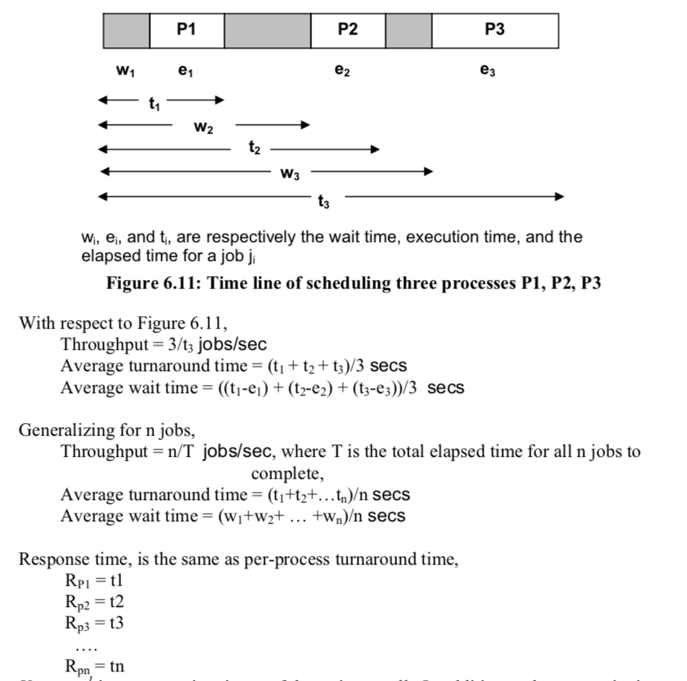

# Processor Scheduling

A processor usually has several *programs* running at any time. How does the processor figure out how to allocate resources to each program?

### Basic Definitions
* **Program:** A set of instructions that makes a computer behave in some predetermined way
* **Process:** A program in execution
* **Address Space:** Space occupied in memory by the program
* **State:** The current contents of the address space and
register values

| Name        | Connotation           | Use  |
| ------------- |:-------------:| -----:|
| Job      | Unit of Scheduling | Synonymous with process |
| Process      | Unit of scheduling      |   A job |
| Thread | Unit of scheduling/ execution; contained within process      |    All the information a CPU needs to execute a set of instructions |
| Task   | Unit of work, unit of scheduling| The promise of a job in the future |

As can be seen from above, **a process is a program plus all the threads that are executing in that program**

### Scheduling Environments
1. Multiprogrammed
	* Programs were cycled through the processor based on relative priority
	* Punch cards, manually entered by human operator
	* Code written in *job control language (JCL)*
2. Time sharing
	* Multiple interactive users, interfacing with data terminals and mini computers
	* An evolution of the multiprogrammed scheme, but requires automation in program scheduling

| Name	| Environment | Role  |
| ----- |:------------:|------:|
| Long Term Scheduler | Batch oriented OS | Control the job mix in memory to balance use of system resources (CPU, memory, I/O) |
| Loader | In every OS | Load user program from disk into memory |
| Medium Term Scheduler | Every modern OS | Balance the mix of processes in memory to avoid thrashing |
| Short Term Scheduler | Every modern OS | Schedule the memory resident processes on the CPU |

### Composition of PCB
A PCB contains what is needed by a process. It contains the current state, where in the program we're executing (PC value), processor register files, the next process, where in memory the process is and a priority (not always important).

### Basics of Scheduling
A typical program cycles between activity on the processor and I/O devices.

* **CPU Burst:** The stretch of time a process runs without making an IO call
* **IO Burst:** The stretch of time a process needs to complete an IO operation

### Performance Metrics
Metrics can be either *system centric* or *user centric*

| Name | Notation | Units | Centricity | Description |
|-----|-----|-----|-----|-----|
| CPU Utilization | - | % | User | Percent of time that the CPU is busy |
| Throughput | n / T | Jobs / sec | System | Metric quantifying the number of jobs n executed in time interval T |
| Avg. Turnaround time | (t1 + t2 + ... + tn) / n | Seconds | System | Metric quantifying the average time it takes for a job to complete |
| Avg. Waiting time | ((t1-e1) + (t2-e2) + ... + (tn-en)) / n | Seconds | System | Metric quantifying the average waiting time that a job experiences |
| Response time/ turnaround time | t*i* | Seconds | User | Metric quantifying the turnaround time for a specific job *i* |
| Variance in Response time | E[(ti – ei)^2] | Seconds^2 | User | Metric that quantifies thevariance of the actual response time experienced by a process from the expected value |
| Starvation | - | - | User | If a job does not make forward progress towards completion |
| Convoy effect | - | - | User | If the scheduling of jobs follows a fixed pattern |

Below is an example of scheduling metrics

## Types of Scheduling
| Name | Preemptive | Starvation | Convoy Effect |
| ---- | ---------- | ---------- | ------------- |
| First Come First Serve | Usually no, sometimes yes | No | Yes |
| Shortest Job First | Usually no, sometimes yes) | Yes | No |
| Priority | Both | Sometimes | Sometimes |
| Shortest Remaining Job First | Yes | Yes | No |
| Round Robin | Yes | No | No |

### Shortest Job First
A problem that is associated with SJF is starvation is the concept of **aging**, where a job that has been waiting for a long time in the ready queue gets preference. This also happens in priority schedulers, and aging can be used to solve the same problem.

### Shortest Time Remaining First
This is SJF with preemption.

