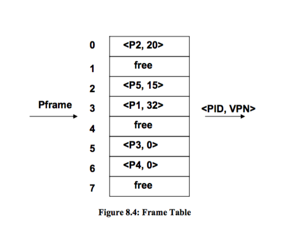
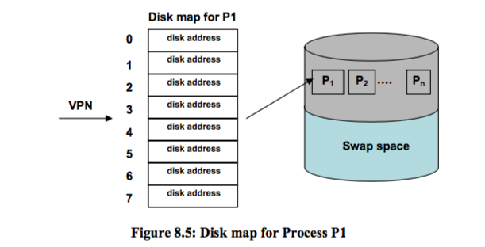
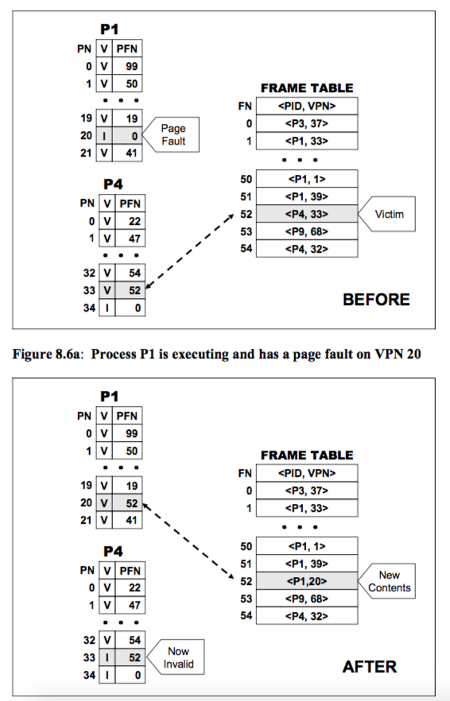
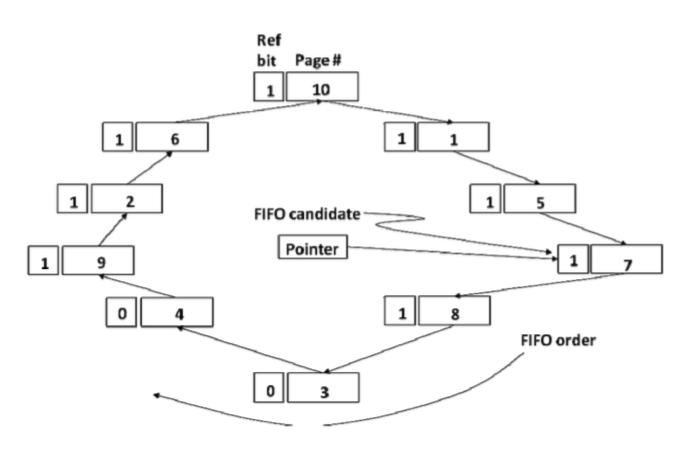
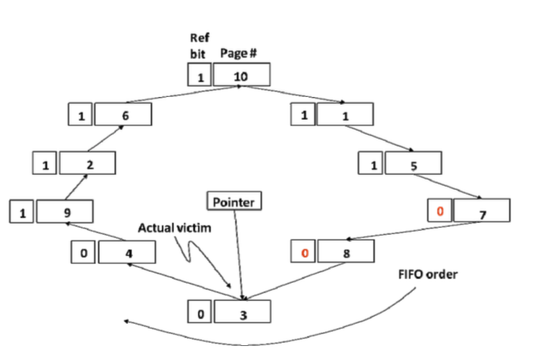
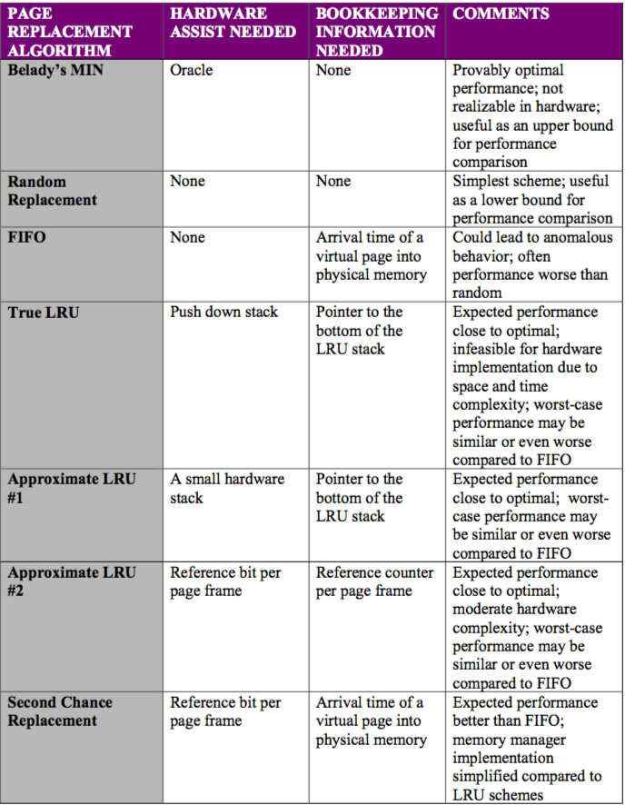
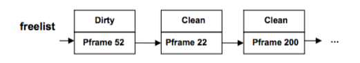
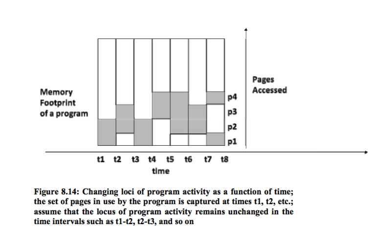
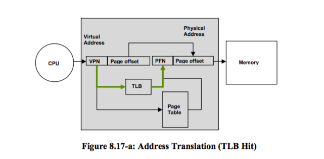

# Details of Paged Based Memory Management

## 8.1 Demand Paging
* We dont usually load the entire program into memory on startup
* Load only parts of the program that are not in memory, on demand
* When we access a page, the page may not be in memory yet so we need additional information to see if it is
* Add a valid bit to each page table entry
* When the program tries to find a certain Page Table Entry, if it cannot find the page this is called a Page Fault
  * this exception is handled by the OS
* To support demand paging processor needs to be capable of restarting an instruction whose execution has been suspended
* Page Fault Handler
  1. Find a free page frame
  2. Load the faulting virtual page from the disk into the free page frame
  3. Update the page table for the faulting process
  4. Place the PCB of the process back in the ready queue of the scheduler
* Data Structures for Demand-Page Memory Management
  1. Free list of Page Frames
    1. list of free page numbers that the memory manager uses to service a page fault
  2. Frame Table
    1. Data structure that contains reverse mapping
    2. given a frame number it gives the process id (PID) and the virtual page number that currently occupies this page frame (place in memory)
    
  3. Disk Map
    1. maps the virtual space to locations on the disk that contain the contents of the pages. This is the disk analog of the page tables. There is one such data structure for each process
    
* Anatomy of a Page Fault
  1. Find a free Page Frame
    1. if there is no free page frame then we choose a victim
  2. Pick the Vicim Page Frame
    1. the memory manager determines the victim process that currently owns the victim page
    2. need to make a distinction between clean and dirty page
      1. clean page is one that has not been modified by the program from the time it was brought from memory into the disk
      2. dirty page is one that has been modified by the program since bringing from the disk
    3. if the page is clean all the manager needs to do is set the PTE corresponding to the page as invalid
    4. if the page is dirty then the manager writes that page back to the disk (flushing the disk), determining the disk location from the disk map
  3. Load the Faulting Page
  4. Updating the page table for faulting process and the frame table
  5. Restart faulting test
  

## 8.2 Interaction Between the Process Scheduler and Memory Manager
* Once the CPU Scheduler Dispatches a process, one of the following events happen
  1. The hardware timer interrupts the CPU resulting in an upcall to the CPU scheduler that may result in a process context switch
  2. The process incurs a page fault resulting in an upcall to the memory manager that results in page fault handling
  3. The process makes a system call (such as requesting an I/O operation) resulting in another subsystem getting an upcall to take the necessary action

## 8.3 Page Replacement Policies
1. For a given string of page references. the policy should result in the least number of page faults
2. Policy should not strive to incur a page fault for the same page again
* **Local Victim Selections** Steal a physical frame from the faulting process itself to satisfy the request
* **Global Victim Selections** Steal a physical frame from any process
* Norm to use global victim selection to increase memory utilization
* Belady's Min
  - ideally if we know the entire string of references we should replace the one that is not referenced for the longest time in the future
  - not feasible because we dont actually know this
  - this is a lower bound on what is possible
* Random Replacement
  - replace a random page
* FIFO
  - chose the longest resident page as the victim
  - circular linked-list QUEUE
* Least-Recently Used
  - victim page is page that has been used the least recently
  - uses a stack, bottom is victim
  - simply not viable
    - takes too much space
    - on every access, hardware has to modify stack
  - more feasible to have a smaller stack, that just saves the X most recently used pages, the algorithm will then just pick a random page not on the stack
  - Approximate RLU #2 (Reference Bit per Page Frame)
    - hardware sets this bit when the CPU accesses any location in the page
    - software reads and resets it
    - we can have a reference bits in the page table
    1. Memory Manager mantains a bit vector per page frame, called a reference counter
    2. every time quantam - after reading the reference bits the memory manager clears them
    3. reference counter with the largest absolute value is the most recently used page
* Second Chance Page Replacement Algorithm
  - Simple Extension to FIFO using the reference bits
  1. Initially the operation system clears the reference bits of all the pages. As the program executes, the hardware sets the refernce bits for the pages reframed by the program
  2. If a page has to be replaced, the memory manager chooses the replacement candidate by the FIFO manner
  3. If the chosen victims reference bit is set, then the manager clears the reference bit, gives it a new arrival time, and repeats step 1. The page is moved to the end of the FIFO queue.
  4. The victim is the first candidate in the FIFO order whose reference is not set
  - pointer moves like a clock around the circular queue
  
  

## Comparison of Different Page Replacement Algorithms

## 8.4 Optimizing Memory Management
* Pool of Free Page Frames
  - always have a minimum number of free page frames to handle page faults
  - memory manager may skip over a dirty page in a page fault b/c then it does not have to wait on I/O to write this stuff to the disk
  
  - sometimes the paging daemon will take away a page from a process currently being used and the process may fault on the associated page if it tries to run
    - if the memory manager has not yet reassigned this page then we can retrieve it from the free-list
    - augment each node in the free-list with a reverse mapping
* Thrashing
  - system is not getting useful work done
  - lets say the procecesses that coexist in memory are all CPU-bound. weird to think processor utilization is low
    - simple answer: too much paging activity
    - as the degree of multiprogramming goes up the CPU utilization goes down after awhile, since you hit a point of diminishing returns when you need to keep paging
    - extensive paging could make a process that is CPU bound more I/O bound since paging is implicit I/O done on behalf of the process by the OS
    - trick is to ensure that a process has a significant number of page frames allocated so that it does not page fault a lot
  - working set - determine the locus of the program (or what pages of a process are being currently accessed the process)
    - denotes the number of distinct pages touched by a process in a window of time
    e
  - memory pressure exerted on the system is the summation of the working set size of all the processes currently competing for resources
  - Controlling Thrashing
    - if the total memory pressure exerted on the system is greater than the total available physical memory, the memory manager decreases the degree of multiprogramming, otherwise it increases it
    - another way is use the observed page fault rate. Set a high and low water mark - want the page fault to be in this range

## 8.5 Other Considerations
* when a process is being swapped - memory manager saves working set = prepaging
* I/O usually pins a page so the daemon does not accidentally replace/move to the free list

## 8.6 Translation Lookaside Buffer (TLB)
* small hardware table where CPU holds recent address translations
* basically a cache of most recent translations
* makes it faster since the recently computed PFNs are basically stored in hardware

