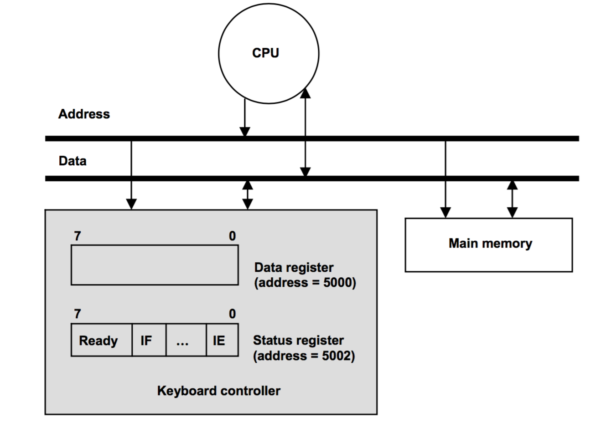
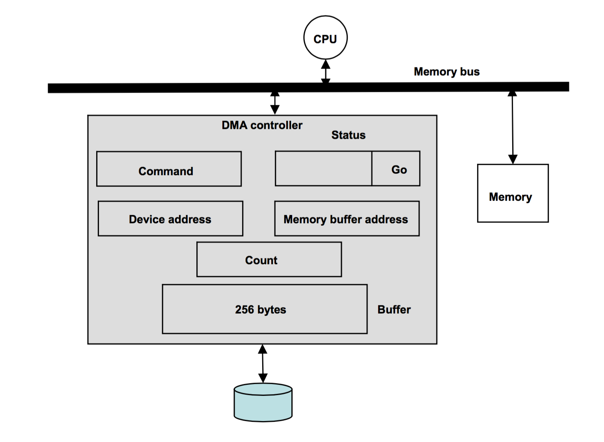
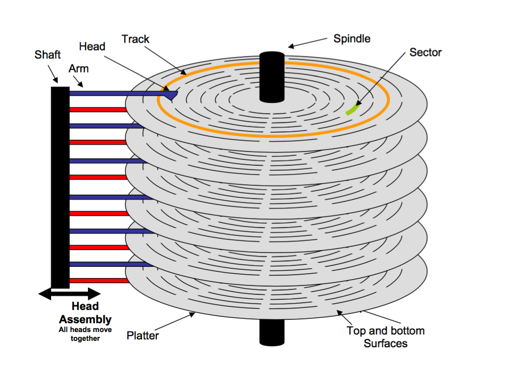
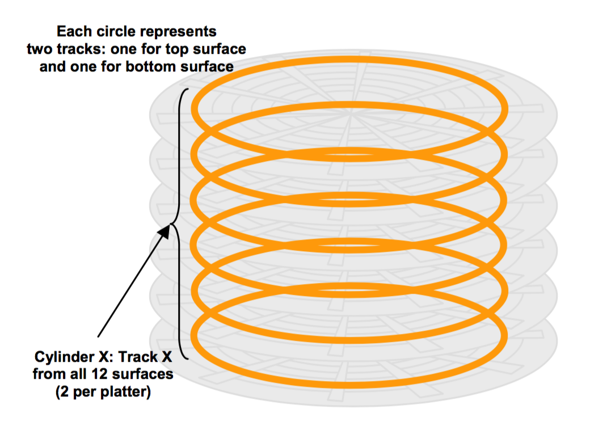
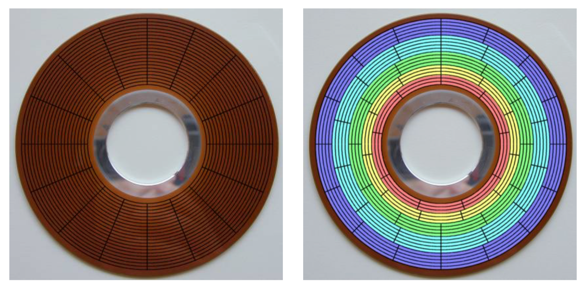

# Input/Output and Stable Storage

## Introduction

I/O devices communicate to the CPU through a device controller.

### Keyboard Controller
* **Data Register:** Storage space for character typed on keyboard
* **Status Register:** Holds the current state of information exchange between keyboard and CPU.

The state in the status register contains:
* **Ready Bit:** Is the char in the data register not seen by the processor yet? This is set by the device.
* **Interrupt Enable (IE):** Is the processor allowing the interrupt to enable it?
* **Interrupt Flag (IF):** Is the controller ready to interrupt the processor?

The CPU sets the IE bit, checks for new data, and reads the data.

### Memory Mapped I/O

In the above diagram, the processor reads and writes to memory using load and store instructions. This technique is known as memory mapped I/O. It allows interaction between the CPU (processor) and the device controller without causing any change to the processor.

In this case of the **data** and **status** registers, the processor views them as memory locations. These registers are given unique memory addresses. High memory addresses are reserved for I/O device registers.

The advantage of memory mapped I/O is that no special I/O instructions are required, but a disadvanatge is that a portion of memory address space is lost to device registers.

## Programmed I/O

This refers to the moving of data back and forth between a device and a processor.

* **Polling:** Processor continually checking if the device has new data.
* **Interrupt:** Enabling interrupt bit for a device upon an interrupt.

Polling and interrupt work for slow-speed devices that produce data asynchronously (data production is not rhythmic). However, programmed I/O doesn't work for high-speed devices like disks that produce data synchronously. There is potential for data loss when programmed I/O is used for high speed devices. Even for slow speed devices, programmed I/O is an inefficient use of the processor's resources.

## Direct Memory Access (DMA)
Device controller has the capability to transfer data between itself and memory without the intervention of the processor. The transfer is initiated by the processor, but then has nothing to do with the transfer itself.

**Streaming Devices:** Once data transfer starts in either direction, data moves in or out of the device continuously until transfer completion.

### Transfer from Device to Memory
* The controller acquires the bus and sends a certain number of bytes into memory. As the bus is used by everone, the data transfer is asynchronous.
* To smooth it out between a synchronous controller and an asynchronous bus, a hardware buffer is needed, between the controller and the bus. The size of the buffer should be as big as the size of the number of bytes sent out (unit of synchronous transfer).
* To initiate a transfer, the processor needs to convey the following to the device controller:
    * Command
    * Address on Device
    * Memory Buffer Address
    * Amount of Data Transfer
* In addition to that, the controller has a status register to record the device status.

* **Cycle Stealing:** This happens when the device controller competes with the processor for memory bus cycles. The device controller *steals* cycles from the processor, but that is not a big deal because the processor works mostly out of the cache.

## Buses
 The bus has the following components:
 * Address lines: Same number as bit addressability of processor
 * Data lines
 * Command lines: Encode the specific command to the memory system
 * Interrupt lines
 * Interrupt Acknowledgment lines
 * Bus arbitration lines

### Design of Buses
* Buses sometimes operate in a synchronous fashion, and sometimes in an asynchronous one.
* Because of the former, there is a **bus clock line** that orchestrates the protocol action on the devices.
* Because of the latter, the bus *master* initiates an action which is done when the bus *slave* responds.
* To increase bus usage, there are **split transaction buses** so several transactions can occur at once.

## I/O Processor

An I/O processor takes a chain of commands for devices and carries them out without interrupting the main processor. The main processor sets up an I/O program in main memory and then starts up the I/O processor. The I/O processor then completes the program and interrupts the processor. This is similar to the DMA controller, except it can handle multiple commands at once.

## Device Driver
It is a part of the OS that issues commands to the device. Its specifics depend on the device characteristics.

## Disks
* Modern disk drives consists of **platters** of lightweight non ferromagnetic material coated with a ferromagnetic material on the top and the bottom.
* There is a central **spindle** that bands these together and rotates.
* There is an array of magnetic read/write heads, one for each surface, and each head doesn't touch the surface.
* An **arm** connects each head to a common **shaft**. Due to this structure, all the heads can be moved in unison in and out of the disk, so all heads line up on their surfaces at the same position.
* A **track** is a circular band of magnetic recording on the platter.
* A **sector** is a contiguous recording of bytes on a track. It's the basic unit of recording on the disk.

* The set of all the tracks form a **cylinder**.

### Recording Types

### Formulas

The capacity of a disk with non-zoned recording is *p* * *n* * *t* * *s* * *b*, where:
* *p* is number of platters
* *n* number of surfaces per platter
* *t* number of tracks per surface
* *s* number of sectors per track
* *b* number of bytes per sector

With zoned recording, the formula is *p* * *n* (\sigma_z (t_zi * s_zi) * *b*) where:
* *z* is the number of zones
* *t_zi* is the number of tracks at zone z_i
* *s_zi* is the number of sectors per track at zone z_i.

The data transfer rate of a disk is (*s* * *b* * *r*)/60 bytes per sec, where:
* *r* is the rotational speed of the disk in RPM (Revolutions per Minute)

The amount of data read in one revolution is *s* * *b* and the time for one revolution, or rotational latency is 60/*r* seconds.

The sector read time is 60/(r * s) seconds, and the average rotational latency is 60/(r * 2) seconds.

**Time to read random sector on a disk**:
* Average seek time (*a*) + Average rotational latency + sector read time
* *a* + 60/(*r* * 2) + 60/(*r* * *s*) seconds
