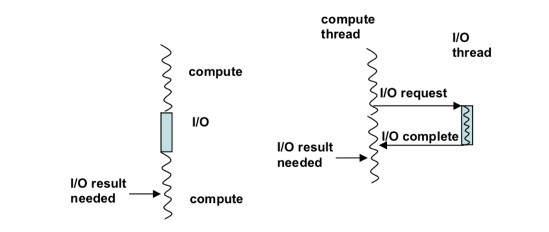
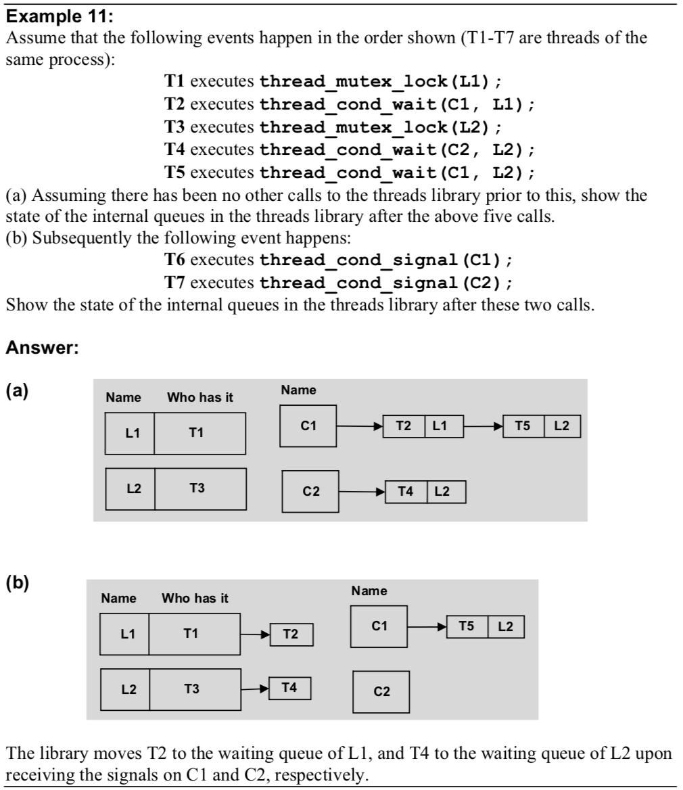
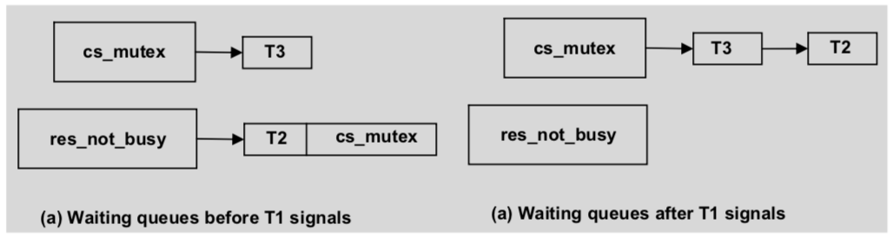
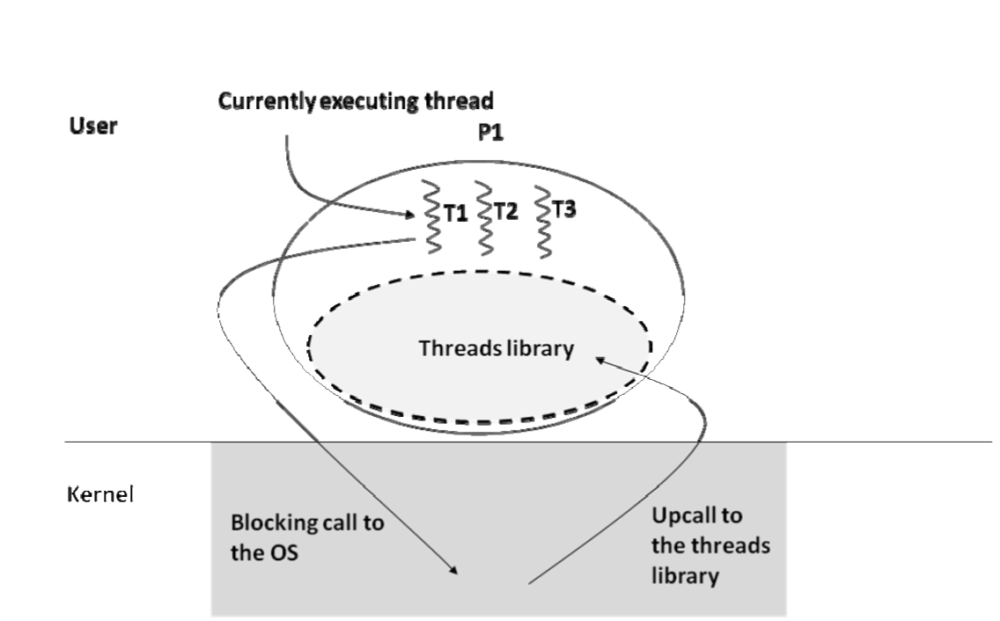
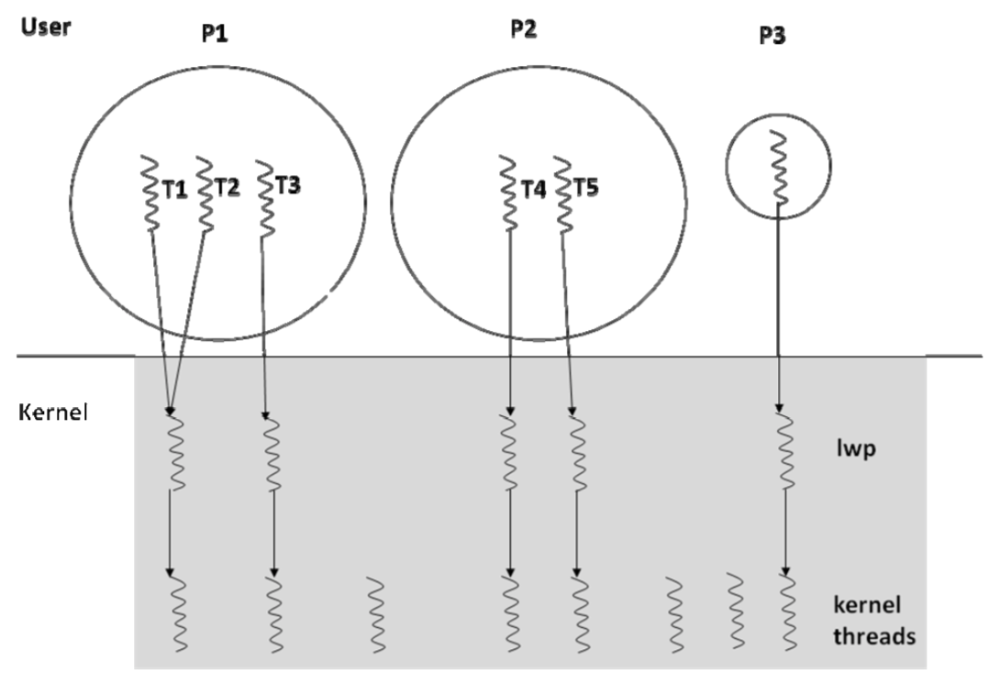

# Chapter 12 Multithreading

- Multithreading - Concurrent Activities

## Threading
- ```thread_create(top-level proedure, args)```

- thread starts executing in a top-level procedure
    - starting point for a threaded program is a normal sequential program
- OS Creates a unique and distinct memory footprint, called the address space
- think of this as a sandbox for everything the program may need
- one fundamental difference between a process and a thread is memory protection
    - each process has its own address space
    - each thread does not 
- a thread automatically terminates when it exits the top-level procedure that it was defined in
- Read-Write Conflict -> multiple threads try to access the same global variable
- Race Condition -> when a Read-Write conflict occurs in a program
- Race Condition does not always imply code is erroneous
    - ie. one thread is waiting on a variable to be changed by another thread
- Data Race -> read0write conflict without a synchronization operation
    - 3 threads adding to a count variable
    - one thread printing the value of count
- once spawned threads may execute in any order
- 4 threads -> 4! combinations (if scheduled by an UniProcessor)
- Fix the non-deterministic behavior by introducting synchronization across threads
- Mutual Exclusion
    - mutex_locks
    - the producer needs to be wary not to change anything when the consumer is reading
    - the execution of one thread inside a particular shared buffer is mutually exclusive
        - meaning another thread cannot be working in the same shared buffer
- Rendezvous
    - spawn a thread to read  a file
    - main cannot continue till the thread completes
    - once thread completes -> join back into main
    - thread-join calls only work for one thread at a time
    - use thread-join to ensure a parent process does not terminate pre-matching
- Mutex_Lock_Type data type
    - internal representation of this variable will have a minimum of two things
        - the thread that is currently holding the lock
        - a queue of waiting requestors (threads that are blocked because they are trying to access this lock), if possible
- Deadlocks and Livelocks
    - Dealock -> thread is waiting for a situation that will never happen
    - Livelock -> thread is actively checking for an event that will never happen
    - threads included in a deadlock are stuck forever
- Condition Variables
    - ```thread_cond_wait(buff_not_empty, bufflock)```
        - allows a thread to wait on a condition variable
        - amounts to the lirbary descheduling the calling thread
        - implicitliy the library performs an unlock on the names lock variable before descheduling the calling thread
    - ```thread_cond_signal(buff_not_empty)```
        -  signals any thread that may be waiting on the named condition variable
        - library knows the lock variable associated with teh wait call, so it performs an implicit lock on it
- cond_var_type
    - queue of threads waiting for signal on this variable
    - for each thread waiting for a signal, the associated mutex lock is also stored with it
- When a condition get signalled we need to check the invariant is true, that the thread waiting has hold of the lock
    - we also need to test the predicated condition upon releasing a lock


- Dispatcher -> thread that dispatches request as they come into one of a pool of worker threads
- the request queue serves to smooth the traffic when the burst of requests exceeds server capacity
- summary of methods
    - ```thread_create(top level procedure, args);```
    - ```thread_terminate (tid);```
    - ```thread_mutex_lock (myLock);```
    - ```thread_mutex_trylock (myLock);```
    - ```thread_mutex_unlock (myLock);```
    - ```thread_join (peer_thread_tid);```
    - ```thread_cond_wait (buf_not_empty, bufLock);```
    - ```thread_cond_signal (buf_not_empty);```

## 12.7 OS Support for Threads
- In single threaded processor - one stack
- In multi threaded processor - multiple stacks
- given process may have multiple threads but since they all share the same address space, they have a common page table in memory
- TCB (thread control block) contains all the state information pertaining to a thread
    - contains PC value, stack pointer value, and teh GPR contents
- User-Level Threads
    - threads still could be implemented at the suer level
    - use of thread libraries
    - the OS just thinks its one process running, the thread scheduler handles the TCB context switching
    - user level threads provide a structuring mechanism without the high cost of a context switch including the operating system
    - problems
        - when a thread makes a blocking system call the OS blocks the whole process since it has no knowledge of the individual threads
        - wrap all OS calls in a library that goes through the threading library
            - means the thread scheduler will not make this call until all threads can't go any further
        - upcall from OS to thread scheduler that a thread is about to make an OS blocking call, thread scheduler then determines when to allow this blocking call
        
- Kernel-Level Threads
    1. All threads live in a single address space. Threads of a single process share a page table
    2. Each thread needs its own stack but share a otehr portions of the memory footprint
    3. OS should support the thread-level synchronization
- Sun-Solaris Thread
    - user threads mapped to a lightweight process
        - multiple threads may be mapped to same lwp
    - one-to-one lwp to kernel threads
    - every process, on startup, is associated with a distinct lwp
    

## 12.8 Hardware Supprot for Multithreading in an Uniprocessor
1. Thread creation and termination
    - dont require special hardware support
2. Communication among threads
3. Synchronization among threads
- datapath actions necessary to implement the block algorithms as follows:
    - read a memory location
    - test whether the value read is 0
    - set the memory location to 1
- to make this atomic, we need to add a new LC-2200 ISA
- ```Test-And-Set memory-location```
- Semaphore
    - binary semaphore, grants or denies access to a single resource to a set of competing threads
    - counting semaphore, may have general version; wherein there are n instances of a given resource; the semaphore grants or denies access to an instance of these n resources to competing threads

## 12.9 Multiprocessors
- Symmetric Multiprocessor, all processors have an indentical view to system resources
- Multiprocessor Cache Coherence
    - each processor has a cache
    - this means that changing the memory of one processor cache may need to be changed on otehr caches especially if the same process has threads running on multiple processor
- Snoop Line
    - a shared bus, allows processor to snoop and see changes in caches
    - write-invalidate protocol
    - write-update protocol


