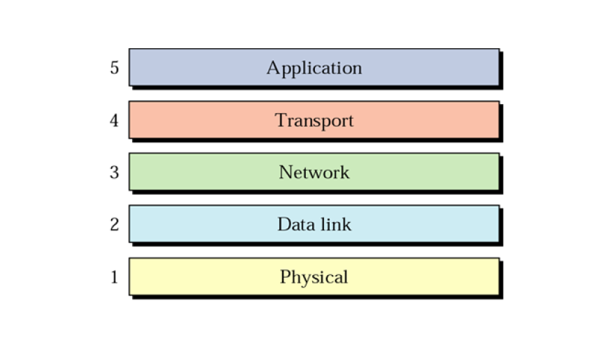

# Networking

Can any modern computer reasonably function without access to the Internet? How exactly do computers network at all with one another?

## Introduction
### Definitions
* **Host:** The computer that hooks onto the network
* **Network Interface Card:** The peripheral controller to hook up to the network
* **Internet:** The composite of several networks
* **IP Address:** An addressing system for all devices on a network
* **Packet:** A unit of data that is transported through the network
* **Packet Loss:** When packets are lost, due to *network congestion*

## Networking Software
The part of the OS dedicated to networking is called the *protocol stack*
* Contains *syntax* and *semantics* of the messages
* *Protocol* refers to the agreed upon convention for two entities to talk to one another
	* Includes information like *packet structure*, *packet size*, etc.

### Problems with Networking
1. **Arbitrary Message Size**: Packets could be of any size, needs to be limited in order to be consistent across network
2. **Out of Order delivery**: No guarantee for the order in which packets are delivered
3. **Packet Loss:** Self Explanatory
4. **Bit Errors** Transient failures that mangle the contents of the packet
5. **Queuing Delays** Affects Transmission Speed

### Structure of Protocol Stack
To solve the above problems, we structure the *protocol stack* to separate all of the above concerns in layers.

As shown above, there are several parts to this stack:
1. **Application Layer:** Responsible for supporting network based applications
	* E.g. MMO games, IM, Email, Web Browser, File Transfer
	* Protocols include HTTP, SMTP, FTP
2. **Transport Layer:** Responsible for taking application layer message and ferries it between ends of communication
	* Protocols include TCP and UDP
3. **Network Layer:** *Routes* the packet from source to destination
	* Given a packet, it finds a way to get the packet to the intended destination address
	* Protocols include Internet Protocol
4. **Data Link Layer:** 
5. **Physical Layer:** Responsible for physically moving the bits of the packet from node to node
	* E.g. Ethernet, WiFi

### OSI Model
There is an alternative network model called the *Open Systems Interconnection suite*

Only two differing layers here:
* **Presentation Layer:** Subsumes any functionality that is common among several applications
	* E.g. Formatting and character conversion
* **Session Layer:** Manager of a specific communcation session between two end points
	* If you are having several IM sessions across the network, this maintains process level information for each specific one

## Transport Layer

* Functionality
	1. Support arbitrary data size at the application level
	2. Support in- order delivery of data
	3. Shield application from loss/ corruption of data
* Data can either be viewed as a *message* or a *data stream*
	* *Message:* One off
		* Leads to *connection oriented*
		* TCP
	* *Data stream:* Data keeps coming
		* Leads to *stream oriented*
		* UDP

### Protocols
The transport layer consists of two main protocols: **TCP** and **UDP**
* **TCP:**
